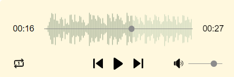
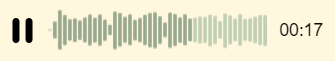

# **react-audio-player-component**
A mobile-friendly audio player for React with a modern look and convenient usage.

[![NPM downloads][npm-download-img]][npm-download-url]
[![Run ESlint][eslint-img]][eslint-url]
[![Run Unit tests][test-img]][test-url] 
[![Run Unit tests][browser-test-img]][browser-test-url] 

[npm-download-img]: https://img.shields.io/npm/dm/react-audio-player-component.svg?style=round-square
[npm-download-url]: https://www.npmjs.com/package/react-audio-player-component
[eslint-img]: https://github.com/samhirtarif/react-audio-player/actions/workflows/lint.yml/badge.svg
[eslint-url]: https://github.com/samhirtarif/react-audio-player/actions/workflows/lint.yml
[test-img]: https://github.com/samhirtarif/react-audio-player/actions/workflows/unit-tests.yml/badge.svg
[test-url]: https://github.com/samhirtarif/react-audio-player/actions/workflows/unit-tests.yml
[browser-test-img]: https://github.com/samhirtarif/react-audio-player/actions/workflows/browser-tests.yml/badge.svg
[browser-test-url]: https://github.com/samhirtarif/react-audio-player/actions/workflows/browser-tests.yml

## Installation
```sh
npm install react-audio-player-component
```

## **AudioPlayer** Component ([Example](https://stackblitz.com/edit/stackblitz-starters-t5nci5?file=src%2FApp.tsx))


<br /><br />

<br />
*Minimal Audio player*

```js
import React, { useState } from 'react';
import { AudioPlayer } from 'react-audio-player-component';

const Player = () => {
  return (
    <AudioPlayer 
      src="audios/test.mp3"
      minimal={false}
      width={350}
      trackHeight={75}
      barWidth={1}
      gap={1}

      visualise={true}
      backgroundColor="#FFF8DE"
      barColor="#C1D0B5"
      barPlayedColor="#99A98F"

      skipDuration={2}
      showLoopOption={true}
      showVolumeControl={true}

      // seekBarColor="purple"
      // volumeControlColor="blue"
      // hideSeekBar={true}
      // hideTrackKnobWhenPlaying={true}
    />
  )
}

```
## Audio element native props
| Props  | Description | Default | Optional |
| :------------ |:--------------- |:--------------- | :--------------- |
| **`src`**  | The address or URL of the a audio resource that is to be considered | N/A | No |
| **`volume`** | Initial volume level for the audio, minimum being `0`, maximum being `1` | `0.75` | Yes |
| **`loop`** | Sets a flag to specify whether playback should restart after it completes | `false` | Yes |
| **`muted`** | Sets a flag that indicates whether the audio is muted | `false` | Yes |
| **`autoplay`** | Sets a value that indicates whether to start playing the media automatically | `false` | Yes |
| **`crossOrigin`** | The CORS setting for this media element. [MDN Reference](https://developer.mozilla.org/en-US/docs/Web/API/HTMLMediaElement/crossOrigin) | `null` | Yes |
| **`autoplay`** | Sets a value indicating what data should be preloaded, if any. Allowed values `""`, `"none"`, `"metadata"`, `"auto"` | `""` | Yes |
| **`playbackRate`** | Sets the rate at which media is being played back | `1.0` | Yes |
---
<br>

## Audio element events
#### `AudioPlayer` supports all the events for `HTMLMediaElement` ([MDN Reference](https://developer.mozilla.org/en-US/docs/Web/API/HTMLMediaElement#events)). All of the events listed in the MDN docs can be passed as a prop to the `AudioPlayer`
---
<br>

## Audio player props
| Props  | Description | Default | Optional |
| :------------ |:--------------- |:--------------- | :--------------- |
| **`minimal`** | Displays a minimal version of the audio player, with only the play/pause button, track bar and timestamp | `false` | Yes |
| **`width`** | Width of the audio player | N/A | No |
| **`barWidth`** | Width of each individual bar in the visualization | `2` | Yes |     
| **`gap`** |  Gap between each bar in the visualization | `1` | Yes |
| **`visualise`** |  Represents whether the audio visualization (waveform) should be displayed | `true` | Yes |
| **`trackHeight`** |  Height of the visualization / trackbar area | `75` | Yes |
| **`backgroundColor`** |  Background color for the audio player | `#EFEFEF` | Yes |
| **`barColor`** |  Color for the bars in the visualization. This only applies to bars that have not currently been played | `"rgb(184, 184, 184)""` | Yes |
| **`barPlayedColor`** |  Color for the bars that have been played | `"rgb(160, 198, 255)""` | Yes |
| **`allowSkip`** |  Represents whether the skip forward/backward options should be displayed | `true` | Yes |
| **`skipDuration`** |  The number of seconds to skip forward/backward | `5` | Yes |
| **`showLoopOption`** |  Represents whether to show the loop options | `true` | Yes |
| **`showVolumeControl`** |  Represents whether the volume control should be shown | `true` | Yes |
| **`seekBarColor`** |  Color for the audio seek bar | `rgba(140, 140, 140)` | Yes |
| **`volumeControlColor`** |  Color for the volumn control | `rgba(140, 140, 140)` | Yes |
| **`hideSeekBar`** |  Hides the seek bar if set to `true`, the audio will still be seekable | `false` | Yes |
| **`hideSeekKnobWhenPlaying`** |  Hides the seek knob when audio is playing if set to `true` | `false` | Yes |

